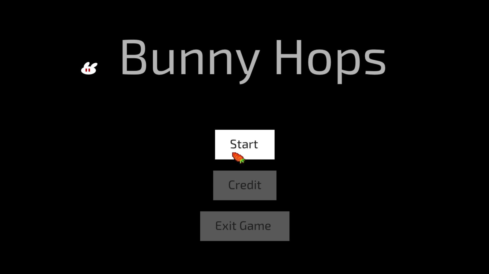

<!-- PROJECT LOGO -->
 

    
  </a>

  <h3 align="center">My Freshman year Personal Game Project</h3>

  

    <a href="https://youtu.be/0Qf01vXzf7c">Demo video</a>
  

<!-- TABLE OF CONTENTS -->

  
Table of Contents

  <ol>
    <li>
      <a href="#about-the-project">About The Project</a>
      <ul>
        <li><a href="#built-with">Built With</a></li>
      </ul>
    </li>
    <li>
      <a href="#roadmap">Roadmap</a>
    </li>
    <li><a href="#copyright">Copyright</a></li>
    <li><a href="#contact">Contact</a></li>
  </ol>

<!-- ABOUT THE PROJECT -->
## About The Project

![Product Name Screen Shot][product-screenshot]

In this project I learned the basic game loop and scene change. I also learned to use 3rd party engine and libraries to handle graphics and inputs. 

The game is about a bunny trying to survive ranging red balls as long as it can.

### Built With

This project was build with libaries provided by course professor [Justin S Chamber](https://www.linkedin.com/in/justinschambers/).
* C_Processing.h
* Engine.h

<!-- ROADMAP -->
## Roadmap

List of features I implemented for this project.

* basic game loop 
* scene change
* handle inputs
* custom mesh
* simple math generated animation (flash screen)
* AABB collision 
* bouncing balls
* gravity
* jump, dash
* timer

<!-- copyright -->
## Copyright

Copyright © 2018 DigiPen, All rights reserved.

<!-- CONTACT -->
## Contact

Garry Chen

 

<!-- MARKDOWN LINKS & IMAGES -->
<!-- https://www.markdownguide.org/basic-syntax/#reference-style-links -->
[linkedin-url]: https://linkedin.com/in/othneildrew
[product-screenshot]: pic/vlcsnap-2021-05-28-16h33m37s004.png

